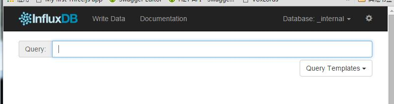

# 安装使用

## 下载地址
直接官网下载就好，非常简单。  
[https://influxdata.com/downloads/#influxdb](https://influxdata.com/downloads/#influxdb)

## 安装
```bash
sudo dpkg -i influxdbName.deb
```

## 启动
```bash
sudo service influxdb start
```

## 使用
启动成功之后，我们就可以开始使用influxDB啦！

### 命令行
在命令行中直接输入influx，就可以管理数据库了。

```bash
root@xtutu:~# influx
Visit https://enterprise.influxdata.com to register for updates, InfluxDB server management, and monitoring.
Connected to http://localhost:8086 version 0.10.0
InfluxDB shell 0.10.0
> show databases
name: databases
---------------
name
_internal
mydb

```

### 使用web页面来操作
在浏览器中输入[localhost:8083](localhost:8083) 即可进入web管理页面。



## 创建一个数据库
```bash
> CREATE DATABASE "testDB"
> show databases
name: databases
---------------
name
_internal
mydb
testDB
```

## 使用数据库
```bash
> use testDB
Using database testDB
```
**现在我们就可以在这个数据库上进行各种操作了！**

*表的增删改查等操作在之后的几个章节里*
