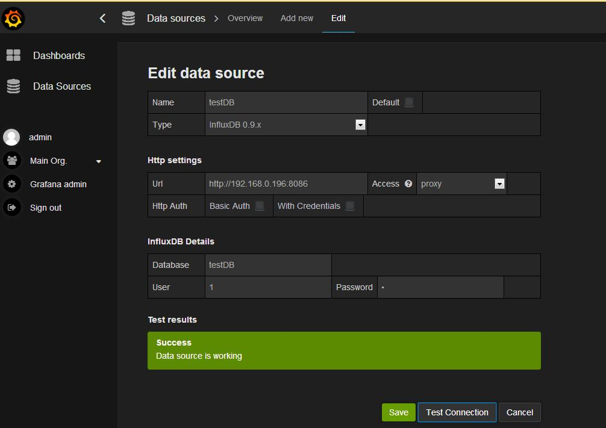
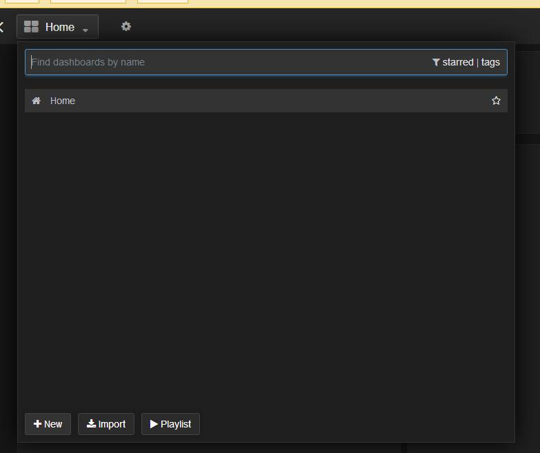
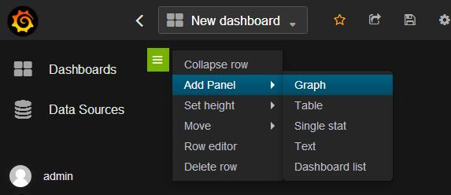
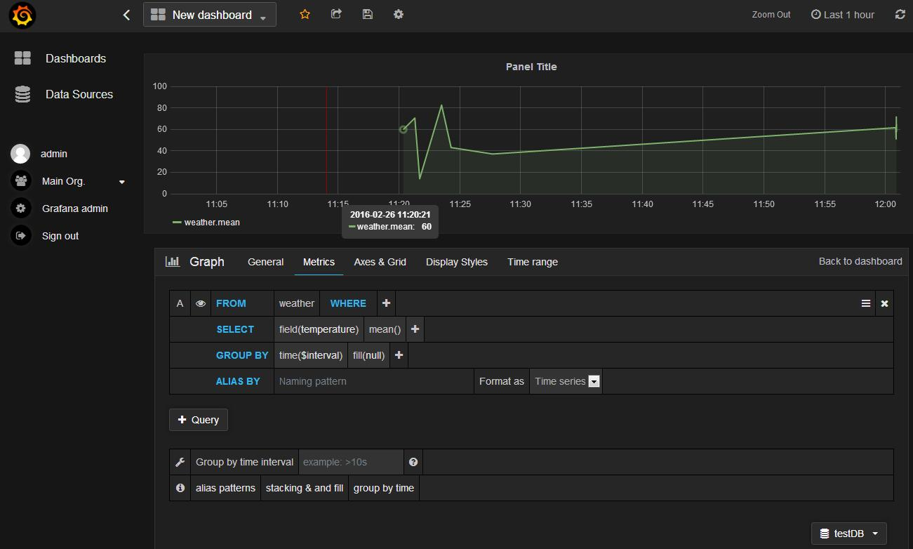

# Grafana简单使用

## 下载安装
Grafana也是用GO语言写的，无任何依赖，安装非常简单。

## 启动
```bash
sudo service grafana-server start
```

## 运行
直接访问：http://your_ip:3000

## 登入
默认帐号：admin  
默认密码：admin  


## 添加数据库
在Data Sources中添加数据库testDB  



其中user和password，如果没有设置过，可以随便填下。  
保存之后，可以通过Test Connection来测试，是否填写正确。  

## 创建Dashboard
点击New按钮就可以了。   



## 添加一个图形界面


## 为界面关联数据
1. 选择testDB数据库
2. 添加查询语句
3. 完美显示！记得保存


